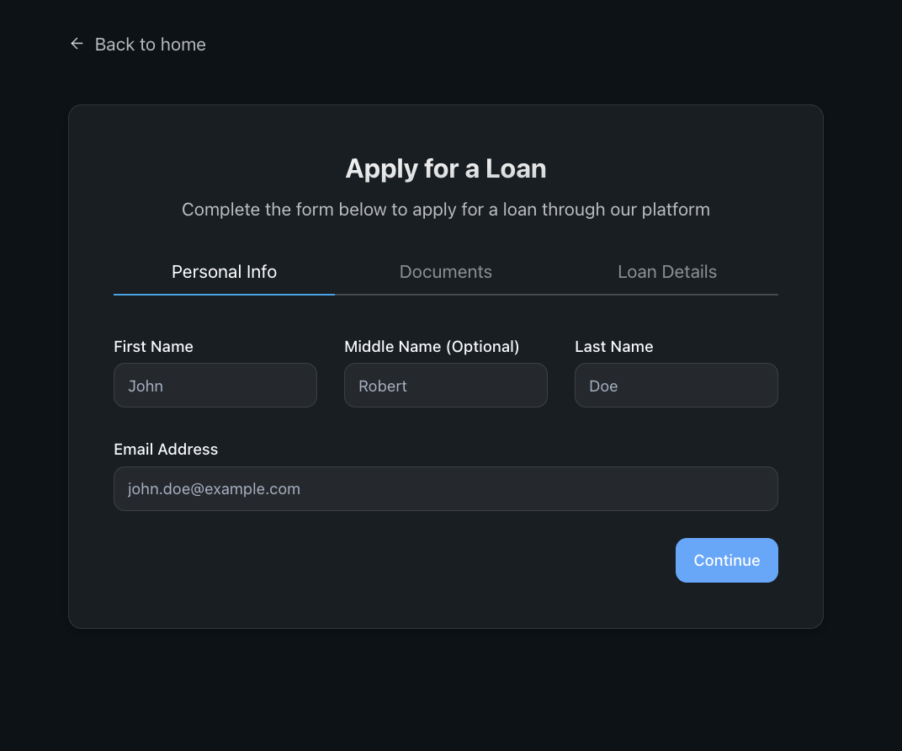

# Personalized Financial Planner & Investment Assistant

Welcome to the **Personalized Financial Planner & Investment Assistant** project. This common README provides an overview of the project’s vision, key features, and instructions to get started. The project is designed to help users understand their personality through a personalized questionnaire and to tailor investment strategies, welfare benefits, expense tracking, and loan eligibility accordingly.

## Key Features

- **Personalized Questionnaire for Investment Planning**  
  Our AI-powered questionnaire helps assess your personality traits, risk tolerance, and financial goals. This insight is used to generate customized investment strategies that fit your unique profile.

- **Welfare Schemes Eligibility & Financial Hacks**  
  Determine your eligibility for various welfare schemes. The system also suggests money-saving tips, tax benefits, and smart hacks driven by your questionnaire responses.

- **Visual Expense Tracker & Pattern Analysis**  
  Import your bank statements to visualize spend patterns. Get detailed expense tracking and analytical insights that help you manage your budget and identify improvement areas.

- **Loan Application & Eligibility Check**  
  Apply for loans directly from the platform. Our system reviews your financial data and questionnaire inputs to check loan eligibility and guide you through the application process.

## Project Architecture

- **Common Core**  
  This README offers an overarching guide for the project.
  
- **Frontend**  
  The frontend application has its own README that details UI/UX, setup, and development guidelines.
  
- **Backend**  
  The backend service is documented separately with its own README, covering API endpoints, deployments, and server configurations.

## Getting Started

1. **Clone the Repository:**  
   Get started by cloning the project repository.

2. **Review Component READMEs:**  
   - Refer to the **Frontend README** for details on the client-side architecture and development.
   - Check the **Backend README** for server-side setup and API documentation.

3. **Installation & Setup:**  
   Follow the instructions provided in the respective READMEs to install dependencies, configure environments, and run the project locally.

## Visual Assets

Our project includes several visuals to enhance your understanding of its features and design. You can view these images below or explore them directly in the Images folder:

## Additional Information

- **Documentation:**  
  Further technical documentation and user guides are available in the repository.

- **Support & Contributions:**  
  Contributions are welcome! For issues, feature requests, or support queries, please open an issue on our GitHub page.

Embark on a seamless journey towards smarter financial planning and investment management tailored just for you.

Happy Investing!
